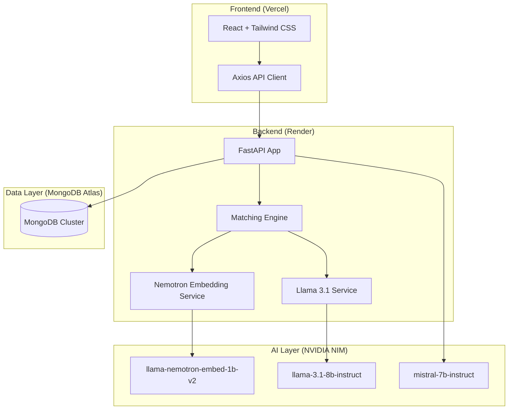

# 🏗️ ScoutFlow AI: System Architecture & Scoring Logic

## 1. System Architecture
ScoutFlow AI uses a modular, cloud-native architecture designed for high-performance AI inference and real-time data sync.

---

## 2. The Matching Logic (The "Brain")
Our scoring system uses a **Hybrid Dual-Pass Evaluation** to ensure candidates are not just "keyword matches" but true technical fits.

### Pass 1: Semantic Vector Search (Weight: 30%)
*   **Model:** `nvidia/llama-nemotron-embed-1b-v2`
*   **Process:** We convert the Job Description (JD) and every Candidate profile (Role + Skills + Experience) into 1024-dimensional vectors. 
*   **Logic:** We calculate the **Cosine Similarity** between the JD and the candidate pool. This filters the top 15 candidates who are "semantically" related to the role, even if they use different synonyms (e.g., matching "Python" to "Django").

### Pass 2: Rigorous AI Evaluation (Weight: 70%)
*   **Model:** `nvidia/llama-3.1-8b-instruct`
*   **Process:** The top candidates from Pass 1 are sent to the LLM for a "Deep Technical Audit."
*   **Logic:** The AI acts as a **Senior Technical Recruiter** and performs:
    1.  **Technical Gap Analysis**: Specifically checking if "Hard Skills" mentioned in the JD are present in the profile.
    2.  **Seniority Match**: Validating if the candidate's years of experience align with the JD requirements.
    3.  **Strict Penalty**: Candidates missing core tools are penalized, preventing generalists from outranking specialists.

### Final Score Calculation
The final score is a weighted average that prioritizes the AI's deep analysis:
`Final Score = (Vector Similarity * 30) + (LLM Match Score * 0.7)`

---

## 3. Engagement Scoring (Simulation)
We use the **Mistral NIM** to simulate a conversation. The system calculates an **Interest Level (0-100)** by analyzing the candidate's simulated response tone and alignment with the recruiter's message. This helps recruiters prioritize candidates who are not just skilled, but also "likely to join."
